<h1 align="center">Welcome to Flutter Train Booking Admin 👋</h1>

<p align="center">
  
  <a>
    
  </a>
  <a>
    
  </a>
  <a href="http://makeapullrequest.com">
    
  </a>
  <a href="https://linkedin.com/in/harshana-rathnayaka">
  
  </a>
</p>

***Star ⭐ the repo if you like what you see. 😎***

> ***An admin app made with Flutter for a train ticket booking system in Sri Lanka***

## 📃 Features

 - Dark Mode
 - Create new train schedules
 - Add new trains
 - Add new Journeys 
 - Delete train schedules
 - Remove a train 
 - Remove a journey 
 - Get the total user count
 - Get the total revenue 

## 👷‍♂️ Built With

* [Flutter](https://flutter.dev)
* [Firebase](https://firebase.google.com/)
* [Razorpay](https://razorpay.com)

## ✨ Requirements
* Any Operating System (ie. MacOS X, Linux, Windows)
* Any IDE with Flutter SDK installed (ie. IntelliJ, Android Studio, VSCode etc.)
* A Firebase account
* A little knowledge of Dart and Flutter

## 🔨 Installation

- Follow the below steps to get up and running
- Run the following `commands` inside Visual Studio Code or any other IDE which has a terminal or you can just use `cmd`

> 👯 Clone the repository

- Clone this repo to your local machine using `https://github.com/Harshana-Rathnayaka/Online-Train-Ticket-Booking-Admin-App`

```shell

$ git clone https://github.com/Harshana-Rathnayaka/Online-Train-Ticket-Booking-Admin-App

```

> 🔥 Add to Firebase
- Create a new project
- Add the app to the project by providing the relevant details and the below package name

```

com.example.flutter_train_admin

```

- Download the `google-services.json` file and add it to the project's `app` directory
- Add the following lines to the project level `build.gradle` file (`<project>/build.gradle`)

```gradle

buildscript {
  repositories {
    // Check that you have the following line (if not, add it):
    google()  // Google's Maven repository
  }
  dependencies {
    ...
    // Add this line
    classpath 'com.google.gms:google-services:4.3.3'
  }
}

allprojects {
  ...
  repositories {
    // Check that you have the following line (if not, add it):
    google()  // Google's Maven repository
    ...
  }
}

```

- Add the following lines to the app level `build.gradle` file (`<project>/<app-module>/build.gradle`)

```gradle

apply plugin: 'com.android.application'
// Add this line
apply plugin: 'com.google.gms.google-services'

dependencies {
  // add the Firebase SDK for Google Analytics
  implementation 'com.google.firebase:firebase-analytics:17.5.0'
  // add SDKs for any other desired Firebase products
  // https://firebase.google.com/docs/android/setup#available-libraries
}

```

- Save the files

> 🏃‍♂️ Run and test the application
- Run the following commands to run and test the application in an emulator or a real device

```dart

$ flutter pub get
$ flutter run

```

## 📸 Screenshots
| Light| Dark|
|------|-------|
|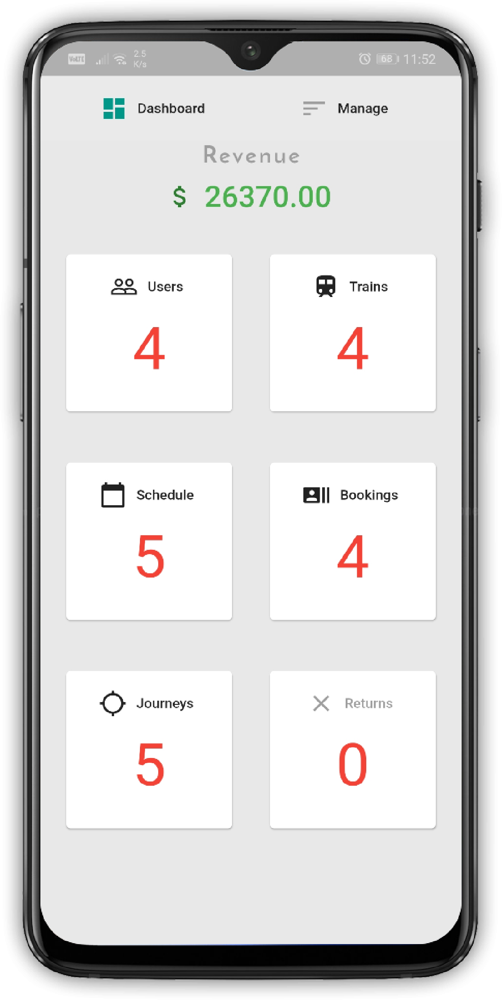|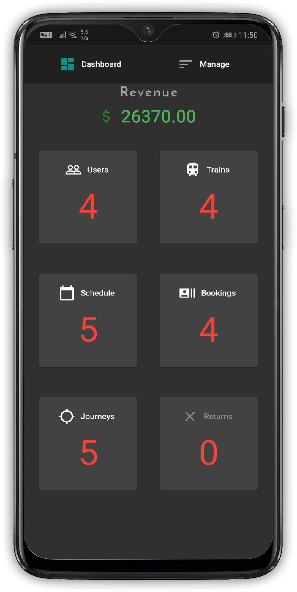|
|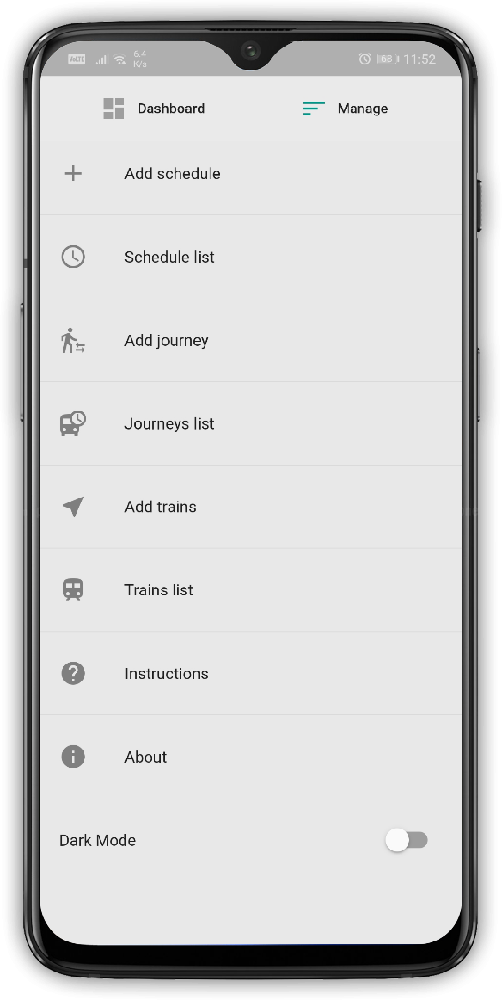|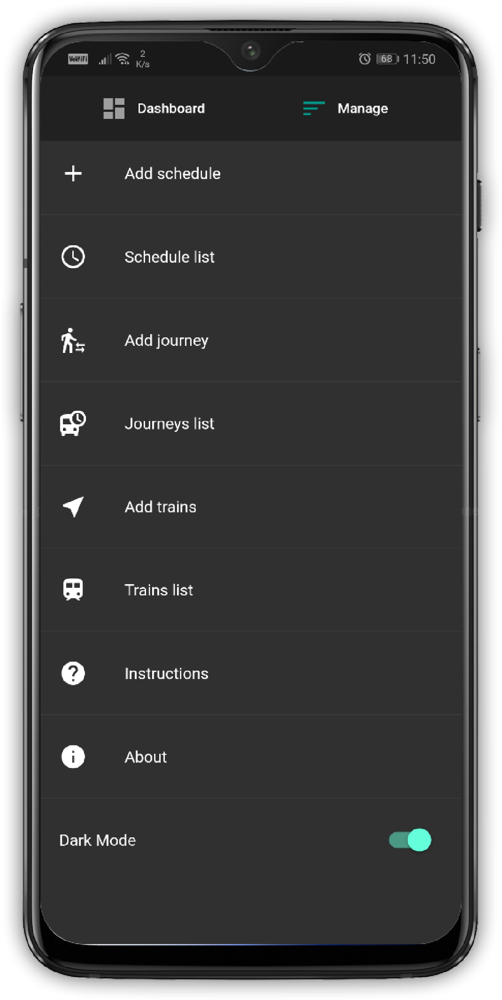|
|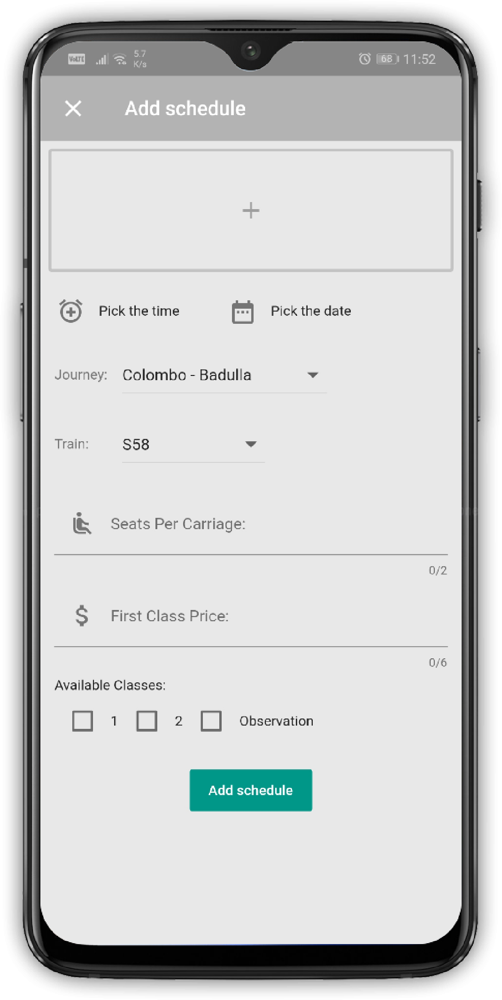|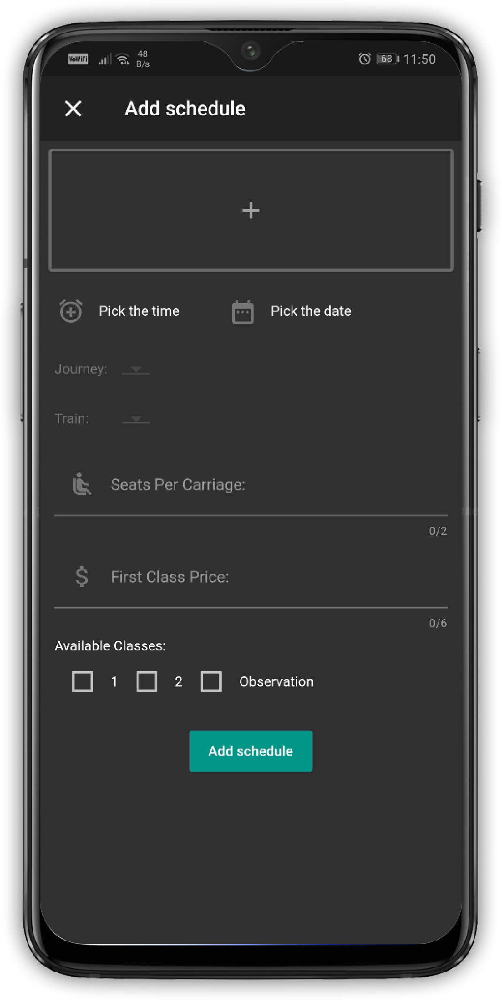|
|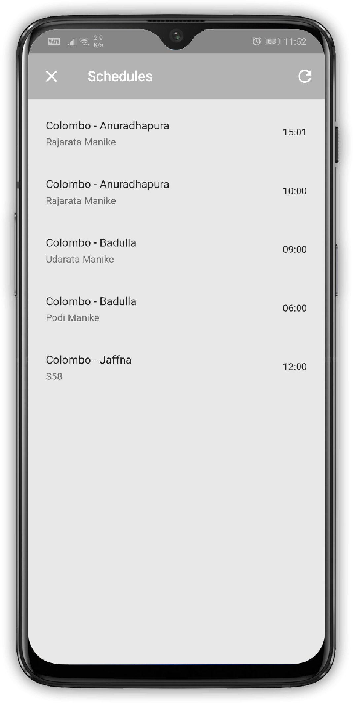|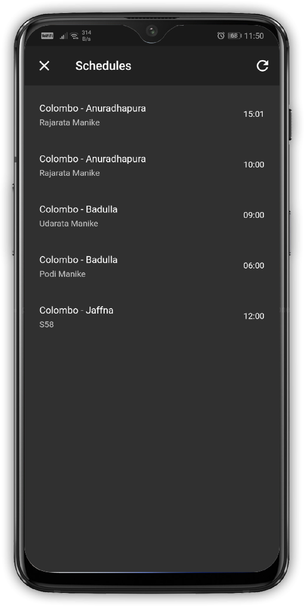|
|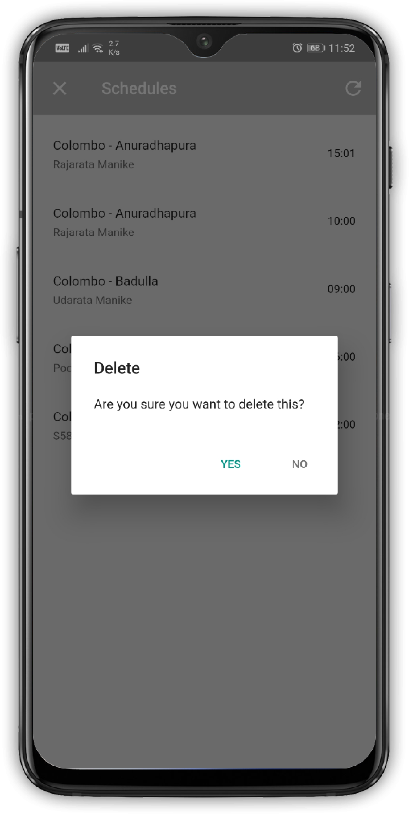|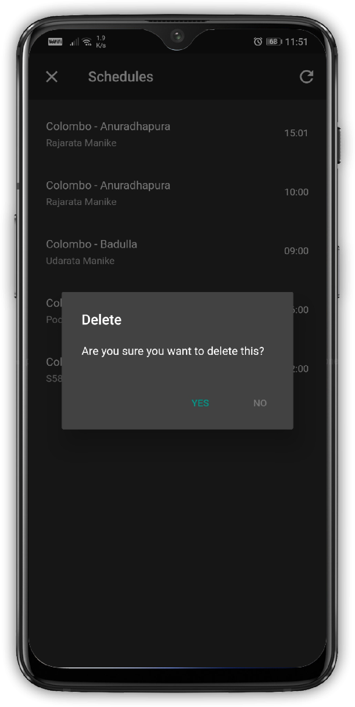|
|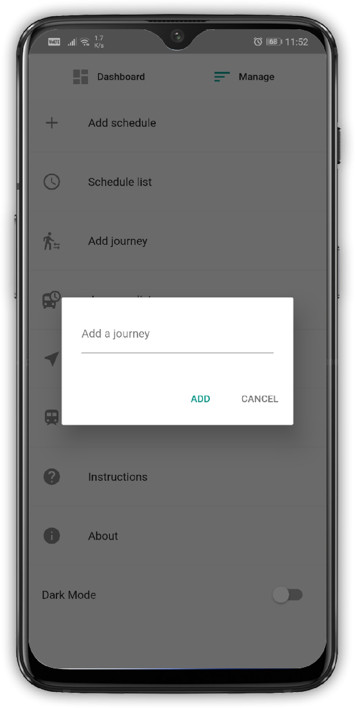||
|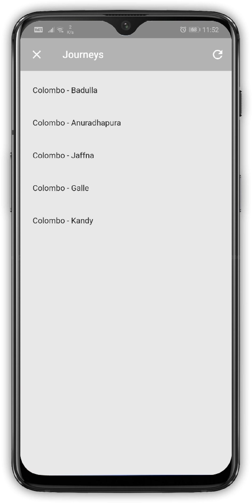|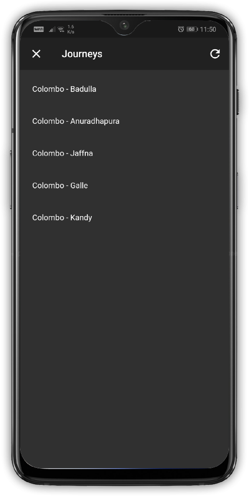|
||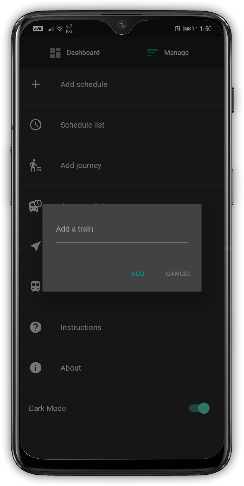|
|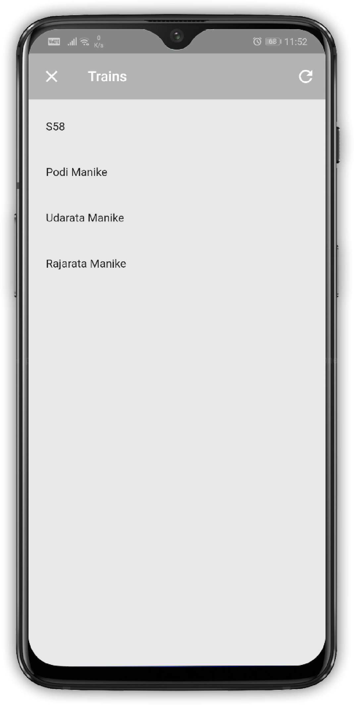|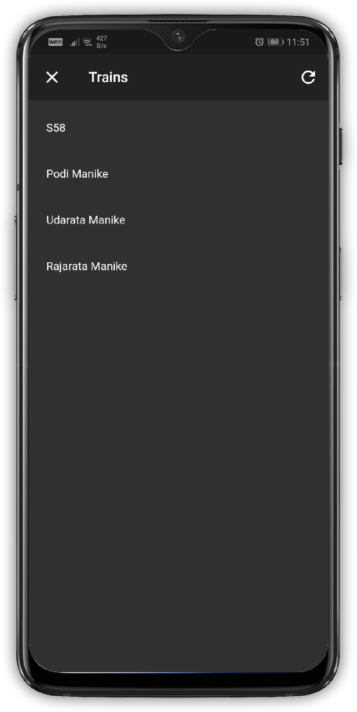|
|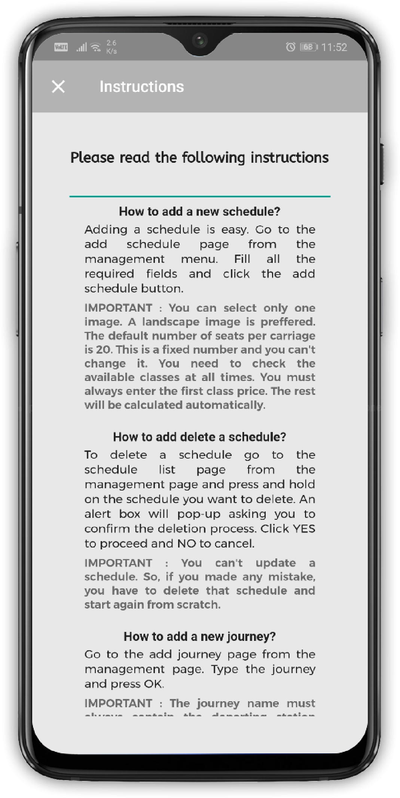|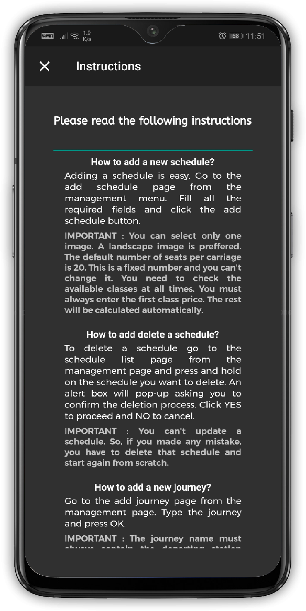|


## 🤓 Author
**Harshana Rathnayaka** 
<br>


## 🤝 Contributing

**Contributions, issues and feature requests are welcome** !<br />Feel free to check out the [issues page]().

## 📝 License


- **[MIT license](http://opensource.org/licenses/mit-license.php)**
- Copyright 2020 © <a href="http://fb.com/DreekoCorporations" target="_blank">Dreeko Corporations</a>

## 🧑 Train Ticket Booking User Application
`https://github.com/Harshana-Rathnayaka/Online-Train-Ticket-Booking-User-App`

